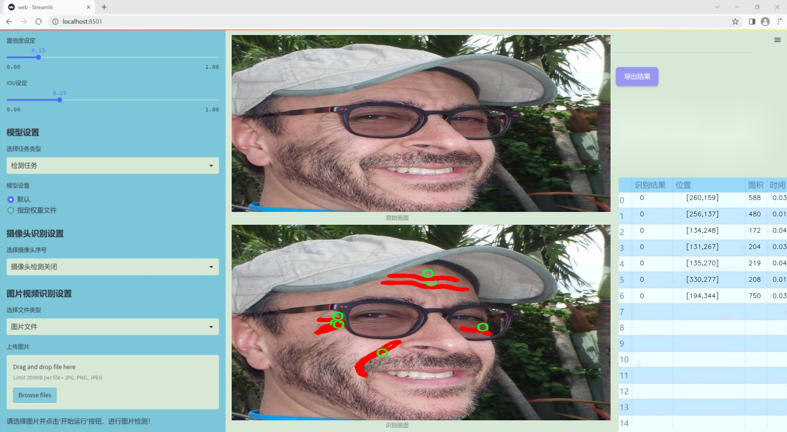
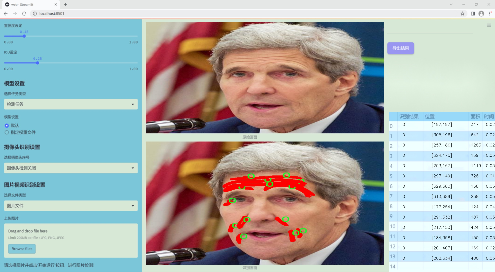
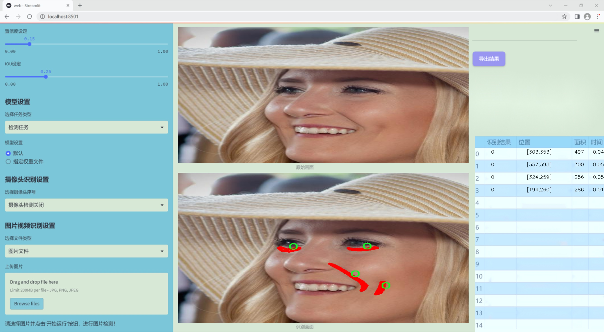
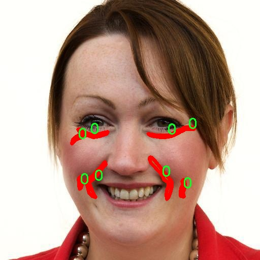
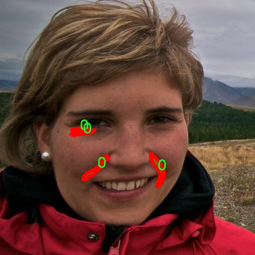

### 1.背景意义

研究背景与意义

随着科技的迅猛发展，计算机视觉技术在各个领域的应用日益广泛，尤其是在工业检测、医疗影像分析和人机交互等方面。皱纹作为一种常见的表面缺陷，不仅影响产品的外观质量，还可能影响其功能性。因此，开发高效的皱纹检测系统具有重要的实际意义。传统的皱纹检测方法多依赖于人工视觉或简单的图像处理技术，这些方法不仅耗时耗力，而且容易受到人为因素的影响，导致检测结果的不一致性和准确性不足。

近年来，深度学习技术的迅猛发展为皱纹检测提供了新的解决方案。YOLO（You Only Look Once）系列模型因其高效的实时检测能力和较高的准确率，成为计算机视觉领域的重要工具。YOLOv11作为该系列的最新版本，具备更强的特征提取能力和更快的推理速度，适合处理复杂的图像数据。在此背景下，基于改进YOLOv11的皱纹检测系统应运而生，旨在提高皱纹检测的自动化水平和准确性。

本研究所使用的数据集包含2300幅图像，经过精心标注，涵盖了皱纹的多种表现形式。通过对这些数据的深入分析与处理，结合YOLOv11的先进特性，我们期望能够构建一个高效、准确的皱纹检测系统。该系统不仅能够提高工业生产中的质量控制效率，还能为相关领域的研究提供有力的数据支持和技术保障。

总之，基于改进YOLOv11的皱纹检测系统的研究，不仅具有重要的理论价值，还有着广泛的应用前景。通过这一研究，我们希望能够推动计算机视觉技术在工业检测领域的进一步发展，为实现智能制造和自动化检测贡献力量。

### 2.视频效果

[2.1 视频效果](https://www.bilibili.com/video/BV1ChCAYhEnp/)

### 3.图片效果







##### [项目涉及的源码数据来源链接](https://kdocs.cn/l/cszuIiCKVNis)**

注意：本项目提供训练的数据集和训练教程,由于版本持续更新,暂不提供权重文件（best.pt）,请按照6.训练教程进行训练后实现上图演示的效果。

### 4.数据集信息

##### 4.1 本项目数据集类别数＆类别名

nc: 1
names: ['0']


该项目为【图像分割】数据集，请在【训练教程和Web端加载模型教程（第三步）】这一步的时候按照【图像分割】部分的教程来训练

##### 4.2 本项目数据集信息介绍

本项目数据集信息介绍

本项目旨在开发和改进YOLOv11的皱纹检测系统，因此所使用的数据集专注于皱纹这一特定主题。数据集的设计充分考虑了皱纹的多样性和复杂性，旨在为深度学习模型提供丰富的训练样本，以提高其在实际应用中的准确性和鲁棒性。该数据集包含一个类别，专门标注为“0”，代表皱纹的不同类型和表现形式。尽管类别数量有限，但数据集中的样本涵盖了多种皱纹特征，包括细纹、深纹、表面纹理等，这些特征在不同的光照条件和肤色背景下均有体现。

为了确保数据集的多样性和代表性，样本的收集过程涉及多种来源，包括高分辨率的皮肤图像、临床医学图像以及自然场景下的皮肤特写。这些图像经过精心标注，确保每个皱纹特征都能被准确识别和分类。此外，数据集还包含了不同年龄段、性别和种族的样本，以增强模型的泛化能力，使其能够适应不同人群的皮肤特征。

在数据预处理阶段，所有图像都经过标准化处理，以确保输入数据的一致性和模型训练的有效性。通过数据增强技术，如旋转、缩放和颜色调整，进一步扩展了数据集的规模和多样性。这种方法不仅提高了模型的训练效率，还增强了其对皱纹检测的适应能力。

总之，本项目的数据集为皱纹检测系统的训练提供了坚实的基础，旨在通过深度学习技术实现对皱纹的高效、准确检测，为相关领域的研究和应用提供支持。







### 5.全套项目环境部署视频教程（零基础手把手教学）

[5.1 所需软件PyCharm和Anaconda安装教程（第一步）](https://www.bilibili.com/video/BV1BoC1YCEKi/?spm_id_from=333.999.0.0&vd_source=bc9aec86d164b67a7004b996143742dc)


[5.2 安装Python虚拟环境创建和依赖库安装视频教程（第二步）](https://www.bilibili.com/video/BV1ZoC1YCEBw?spm_id_from=333.788.videopod.sections&vd_source=bc9aec86d164b67a7004b996143742dc)

### 6.改进YOLOv11训练教程和Web_UI前端加载模型教程（零基础手把手教学）

[6.1 改进YOLOv11训练教程和Web_UI前端加载模型教程（第三步）](https://www.bilibili.com/video/BV1BoC1YCEhR?spm_id_from=333.788.videopod.sections&vd_source=bc9aec86d164b67a7004b996143742dc)


按照上面的训练视频教程链接加载项目提供的数据集，运行train.py即可开始训练



     Epoch   gpu_mem       box       obj       cls    labels  img_size
     1/200     20.8G   0.01576   0.01955  0.007536        22      1280: 100%|██████████| 849/849 [14:42<00:00,  1.04s/it]
               Class     Images     Labels          P          R     mAP@.5 mAP@.5:.95: 100%|██████████| 213/213 [01:14<00:00,  2.87it/s]
                 all       3395      17314      0.994      0.957      0.0957      0.0843

     Epoch   gpu_mem       box       obj       cls    labels  img_size
     2/200     20.8G   0.01578   0.01923  0.007006        22      1280: 100%|██████████| 849/849 [14:44<00:00,  1.04s/it]
               Class     Images     Labels          P          R     mAP@.5 mAP@.5:.95: 100%|██████████| 213/213 [01:12<00:00,  2.95it/s]
                 all       3395      17314      0.996      0.956      0.0957      0.0845

     Epoch   gpu_mem       box       obj       cls    labels  img_size
     3/200     20.8G   0.01561    0.0191  0.006895        27      1280: 100%|██████████| 849/849 [10:56<00:00,  1.29it/s]
               Class     Images     Labels          P          R     mAP@.5 mAP@.5:.95: 100%|███████   | 187/213 [00:52<00:00,  4.04it/s]
                 all       3395      17314      0.996      0.957      0.0957      0.0845


###### [项目数据集下载链接](https://kdocs.cn/l/cszuIiCKVNis)

### 7.原始YOLOv11算法讲解

YOLOv11是Ultralytics推出的YOLO系列最新版本，专为实现尖端的物体检测而设计。其架构和训练方法上进行了重大改进，使之不仅具备卓越的准确性和处理速度，还在计算效率上实现了一场革命。得益于其改进的主干和颈部架构，YOLOv11在特征提取和处理复杂任务时表现更加出色。在2024年9月27日，Ultralytics通过长达九小时的在线直播发布这一新作，展示了其在计算机视觉领域的革新。

YOLOv11通过精细的架构设计和优化训练流程，在保持高精度的同时，缩减了参数量，与YOLOv8m相比减少了22%的参数，使其在COCO数据集上的平均准确度（mAP）有所提升。这种效率的提高使YOLOv11非常适合部署在各种硬件环境中，包括边缘设备、云计算平台以及支持NVIDIA GPU的系统，确保在灵活性上的优势。

该模型支持广泛的任务，从对象检测、实例分割到图像分类、姿态估计和定向对象检测（OBB），几乎覆盖了计算机视觉的所有主要挑战。其创新的C3k2和C2PSA模块提升了网络深度和注意力机制的应用，提高了特征提取的效率和效果。同时，YOLOv11的改进网络结构也使之在复杂视觉任务上得以从容应对，成为各类计算机视觉任务的多功能选择。这些特性令YOLOv11在实施实时物体检测的各个领域中表现出众。
* * *

2024年9月27日，Ultralytics在线直播长达九小时，为YOLO11召开“发布会”

YOLO11 是 Ultralytics YOLO 系列实时物体检测器的最新版本，它以尖端的准确性、速度和效率重新定义了可能性。在之前 YOLO
版本的显著进步的基础上，YOLO11 在架构和训练方法方面进行了重大改进，使其成为各种计算机视觉任务的多功能选择。


##### YOLO11主要特点：

  * 增强的特征提取：YOLO11 采用了改进的主干和颈部架构，增强了特征提取能力，可实现更精确的对象检测和复杂任务性能。
  * 针对效率和速度进行了优化：YOLO11 引入了完善的架构设计和优化的训练流程，可提供更快的处理速度，并在准确度和性能之间保持最佳平衡。
  * 更少的参数，更高的准确度：借助模型设计的进步，YOLO11m 在 COCO 数据集上实现了更高的平均准确度 (mAP)，同时使用的参数比 YOLOv8m 少 22%，从而提高了计算效率，同时又不影响准确度。
  * 跨环境的适应性：YOLO11 可以无缝部署在各种环境中，包括边缘设备、云平台和支持 NVIDIA GPU 的系统，从而确保最大的灵活性。
  * 支持的任务范围广泛：无论是对象检测、实例分割、图像分类、姿势估计还是定向对象检测 (OBB)，YOLO11 都旨在满足各种计算机视觉挑战。

##### 支持的任务和模式

YOLO11 以 YOLOv8 中引入的多功能模型系列为基础，为各种计算机视觉任务提供增强的支持：

Model| Filenames| Task| Inference| Validation| Training| Export  
---|---|---|---|---|---|---  
YOLO11| yolol11n.pt, yolol11s.pt, yolol11m.pt, yolol11x.pt| Detection| ✅| ✅|
✅| ✅  
YOLO11-seg| yolol11n-seg.pt, yolol11s-seg.pt, yolol11m-seg.pt,
yolol11x-seg.pt| Instance Segmentation| ✅| ✅| ✅| ✅  
YOLO11-pose| yolol11n-pose.pt, yolol11s-pose.pt, yolol11m-pose.pt,
yolol11x-pose.pt| Pose/Keypoints| ✅| ✅| ✅| ✅  
YOLO11-obb| yolol11n-obb.pt, yolol11s-obb.pt, yolol11m-obb.pt,
yolol11x-obb.pt| Oriented Detection| ✅| ✅| ✅| ✅  
YOLO11-cls| yolol11n-cls.pt, yolol11s-cls.pt, yolol11m-cls.pt,
yolol11x-cls.pt| Classification| ✅| ✅| ✅| ✅  
  
##### 简单的 YOLO11 训练和推理示例

以下示例适用于用于对象检测的 YOLO11 Detect 模型。

    
    
    from ultralytics import YOLO
    
    # Load a model
    model = YOLO("yolo11n.pt")
    
    # Train the model
    train_results = model.train(
        data="coco8.yaml",  # path to dataset YAML
        epochs=100,  # number of training epochs
        imgsz=640,  # training image size
        device="cpu",  # device to run on, i.e. device=0 or device=0,1,2,3 or device=cpu
    )
    
    # Evaluate model performance on the validation set
    metrics = model.val()
    
    # Perform object detection on an image
    results = model("path/to/image.jpg")
    results[0].show()
    
    # Export the model to ONNX format
    path = model.export(format="onnx")  # return path to exported model

##### 支持部署于边缘设备

YOLO11 专为适应各种环境而设计，包括边缘设备。其优化的架构和高效的处理能力使其适合部署在边缘设备、云平台和支持 NVIDIA GPU
的系统上。这种灵活性确保 YOLO11 可用于各种应用，从移动设备上的实时检测到云环境中的复杂分割任务。有关部署选项的更多详细信息，请参阅导出文档。

##### YOLOv11 yaml文件

    
    
    # Ultralytics YOLO 🚀, AGPL-3.0 license
    # YOLO11 object detection model with P3-P5 outputs. For Usage examples see https://docs.ultralytics.com/tasks/detect
    
    # Parameters
    nc: 80 # number of classes
    scales: # model compound scaling constants, i.e. 'model=yolo11n.yaml' will call yolo11.yaml with scale 'n'
      # [depth, width, max_channels]
      n: [0.50, 0.25, 1024] # summary: 319 layers, 2624080 parameters, 2624064 gradients, 6.6 GFLOPs
      s: [0.50, 0.50, 1024] # summary: 319 layers, 9458752 parameters, 9458736 gradients, 21.7 GFLOPs
      m: [0.50, 1.00, 512] # summary: 409 layers, 20114688 parameters, 20114672 gradients, 68.5 GFLOPs
      l: [1.00, 1.00, 512] # summary: 631 layers, 25372160 parameters, 25372144 gradients, 87.6 GFLOPs
      x: [1.00, 1.50, 512] # summary: 631 layers, 56966176 parameters, 56966160 gradients, 196.0 GFLOPs
    
    # YOLO11n backbone
    backbone:
      # [from, repeats, module, args]
      - [-1, 1, Conv, [64, 3, 2]] # 0-P1/2
      - [-1, 1, Conv, [128, 3, 2]] # 1-P2/4
      - [-1, 2, C3k2, [256, False, 0.25]]
      - [-1, 1, Conv, [256, 3, 2]] # 3-P3/8
      - [-1, 2, C3k2, [512, False, 0.25]]
      - [-1, 1, Conv, [512, 3, 2]] # 5-P4/16
      - [-1, 2, C3k2, [512, True]]
      - [-1, 1, Conv, [1024, 3, 2]] # 7-P5/32
      - [-1, 2, C3k2, [1024, True]]
      - [-1, 1, SPPF, [1024, 5]] # 9
      - [-1, 2, C2PSA, [1024]] # 10
    
    # YOLO11n head
    head:
      - [-1, 1, nn.Upsample, [None, 2, "nearest"]]
      - [[-1, 6], 1, Concat, [1]] # cat backbone P4
      - [-1, 2, C3k2, [512, False]] # 13
    
      - [-1, 1, nn.Upsample, [None, 2, "nearest"]]
      - [[-1, 4], 1, Concat, [1]] # cat backbone P3
      - [-1, 2, C3k2, [256, False]] # 16 (P3/8-small)
    
      - [-1, 1, Conv, [256, 3, 2]]
      - [[-1, 13], 1, Concat, [1]] # cat head P4
      - [-1, 2, C3k2, [512, False]] # 19 (P4/16-medium)
    
      - [-1, 1, Conv, [512, 3, 2]]
      - [[-1, 10], 1, Concat, [1]] # cat head P5
      - [-1, 2, C3k2, [1024, True]] # 22 (P5/32-large)
    
      - [[16, 19, 22], 1, Detect, [nc]] # Detect(P3, P4, P5)
    

**YOLO11和YOLOv8 yaml文件的区别**


##### 改进模块代码

  * C3k2 

    
    
    class C3k2(C2f):
        """Faster Implementation of CSP Bottleneck with 2 convolutions."""
    
        def __init__(self, c1, c2, n=1, c3k=False, e=0.5, g=1, shortcut=True):
            """Initializes the C3k2 module, a faster CSP Bottleneck with 2 convolutions and optional C3k blocks."""
            super().__init__(c1, c2, n, shortcut, g, e)
            self.m = nn.ModuleList(
                C3k(self.c, self.c, 2, shortcut, g) if c3k else Bottleneck(self.c, self.c, shortcut, g) for _ in range(n)
            )

C3k2，它是具有两个卷积的CSP（Partial Cross Stage）瓶颈架构的更快实现。

**类继承：**

  * `C3k2`继承自类`C2f`。这表明`C2f`很可能实现了经过修改的基本CSP结构，而`C3k2`进一步优化或修改了此结构。

**构造函数（`__init__`）：**

  * `c1`：输入通道。

  * `c2`：输出通道。

  * `n`：瓶颈层数（默认为1）。

  * `c3k`：一个布尔标志，确定是否使用`C3k`块或常规`Bottleneck`块。

  * `e`：扩展比率，控制隐藏层的宽度（默认为0.5）。

  * `g`：分组卷积的组归一化参数或组数（默认值为 1）。

  * `shortcut`：一个布尔值，用于确定是否在网络中包含快捷方式连接（默认值为 `True`）。

**初始化：**

  * `super().__init__(c1, c2, n, short-cut, g, e)` 调用父类 `C2f` 的构造函数，初始化标准 CSP 组件，如通道数、快捷方式、组等。

**模块列表（`self.m`）：**

  * `nn.ModuleList` 存储 `C3k` 或 `Bottleneck` 模块，具体取决于 `c3k` 的值。

  * 如果 `c3k` 为 `True`，它会初始化 `C3k` 模块。`C3k` 模块接收以下参数：

  * `self.c`：通道数（源自 `C2f`）。

  * `2`：这表示在 `C3k` 块内使用了两个卷积层。

  * `shortcut` 和 `g`：从 `C3k2` 构造函数传递。

  * 如果 `c3k` 为 `False`，则初始化标准 `Bottleneck` 模块。

`for _ in range(n)` 表示将创建 `n` 个这样的块。

**总结：**

  * `C3k2` 实现了 CSP 瓶颈架构，可以选择使用自定义 `C3k` 块（具有两个卷积）或标准 `Bottleneck` 块，具体取决于 `c3k` 标志。

  * C2PSA

    
    
    class C2PSA(nn.Module):
        """
        C2PSA module with attention mechanism for enhanced feature extraction and processing.
    
        This module implements a convolutional block with attention mechanisms to enhance feature extraction and processing
        capabilities. It includes a series of PSABlock modules for self-attention and feed-forward operations.
    
        Attributes:
            c (int): Number of hidden channels.
            cv1 (Conv): 1x1 convolution layer to reduce the number of input channels to 2*c.
            cv2 (Conv): 1x1 convolution layer to reduce the number of output channels to c.
            m (nn.Sequential): Sequential container of PSABlock modules for attention and feed-forward operations.
    
        Methods:
            forward: Performs a forward pass through the C2PSA module, applying attention and feed-forward operations.
    
        Notes:
            This module essentially is the same as PSA module, but refactored to allow stacking more PSABlock modules.
    
        Examples:
            >>> c2psa = C2PSA(c1=256, c2=256, n=3, e=0.5)
            >>> input_tensor = torch.randn(1, 256, 64, 64)
            >>> output_tensor = c2psa(input_tensor)
        """
    
        def __init__(self, c1, c2, n=1, e=0.5):
            """Initializes the C2PSA module with specified input/output channels, number of layers, and expansion ratio."""
            super().__init__()
            assert c1 == c2
            self.c = int(c1 * e)
            self.cv1 = Conv(c1, 2 * self.c, 1, 1)
            self.cv2 = Conv(2 * self.c, c1, 1)
    
            self.m = nn.Sequential(*(PSABlock(self.c, attn_ratio=0.5, num_heads=self.c // 64) for _ in range(n)))
    
        def forward(self, x):
            """Processes the input tensor 'x' through a series of PSA blocks and returns the transformed tensor."""
            a, b = self.cv1(x).split((self.c, self.c), dim=1)
            b = self.m(b)
            return self.cv2(torch.cat((a, b), 1))

`C2PSA` 模块是一个自定义神经网络层，带有注意力机制，用于增强特征提取和处理。

**类概述**

  * **目的：**

  * `C2PSA` 模块引入了一个卷积块，利用注意力机制来改进特征提取和处理。

  * 它使用一系列 `PSABlock` 模块，这些模块可能代表某种形式的位置自注意力 (PSA)，并且该架构旨在允许堆叠多个 `PSABlock` 层。

**构造函数（`__init__`）：**

  * **参数：**

  * `c1`：输入通道（必须等于 `c2`）。

  * `c2`：输出通道（必须等于 `c1`）。

  * `n`：要堆叠的 `PSABlock` 模块数量（默认值为 1）。

  * `e`：扩展比率，用于计算隐藏通道的数量（默认值为 0.5）。

  * **属性：**

  * `self.c`：隐藏通道数，计算为 `int(c1 * e)`。

  * `self.cv1`：一个 `1x1` 卷积，将输入通道数从 `c1` 减少到 `2 * self.c`。这为将输入分成两部分做好准备。

  * `self.cv2`：另一个 `1x1` 卷积，处理后将通道维度恢复回 `c1`。

  * `self.m`：一系列 `PSABlock` 模块。每个 `PSABlock` 接收 `self.c` 通道，注意头的数量为 `self.c // 64`。每个块应用注意和前馈操作。

**前向方法：**

  * **输入：**

  * `x`，输入张量。

  * **操作：**

  1. `self.cv1(x)` 应用 `1x1` 卷积，将输入通道大小从 `c1` 减小到 `2 * self.c`。

  2. 生成的张量沿通道维度分为两部分，`a` 和 `b`。

  * `a`：第一个 `self.c` 通道。

  * `b`：剩余的 `self.c` 通道。

  1. `b` 通过顺序容器 `self.m`，它是 `PSABlock` 模块的堆栈。这部分经过基于注意的处理。

  2. 处理后的张量 `b` 与 `a` 连接。

  3. `self.cv2` 应用 `1x1` 卷积，将通道大小恢复为 `c1`。

  * **输出：**

  * 应用注意和卷积操作后的变换后的张量。

**总结：**

  * **C2PSA** 是一个增强型卷积模块，它通过堆叠的 `PSABlock` 模块应用位置自注意力。它拆分输入张量，将注意力应用于其中一部分，然后重新组合并通过最终卷积对其进行处理。此结构有助于从输入数据中提取复杂特征。

##### 网络结构


### 8.200+种全套改进YOLOV11创新点原理讲解

#### 8.1 200+种全套改进YOLOV11创新点原理讲解大全

由于篇幅限制，每个创新点的具体原理讲解就不全部展开，具体见下列网址中的改进模块对应项目的技术原理博客网址【Blog】（创新点均为模块化搭建，原理适配YOLOv5~YOLOv11等各种版本）

[改进模块技术原理博客【Blog】网址链接](https://gitee.com/qunmasj/good)


#### 8.2 精选部分改进YOLOV11创新点原理讲解

###### 这里节选部分改进创新点展开原理讲解(完整的改进原理见上图和[改进模块技术原理博客链接](https://gitee.com/qunmasj/good)【如果此小节的图加载失败可以通过CSDN或者Github搜索该博客的标题访问原始博客，原始博客图片显示正常】

### 动态蛇形卷积Dynamic Snake Convolution

参考论文： 2307.08388.pdf (arxiv.org)

血管、道路等拓扑管状结构的精确分割在各个领域都至关重要，确保下游任务的准确性和效率。 然而，许多因素使任务变得复杂，包括薄的局部结构和可变的全局形态。在这项工作中，我们注意到管状结构的特殊性，并利用这些知识来指导我们的 DSCNet 在三个阶段同时增强感知：特征提取、特征融合、 和损失约束。 首先，我们提出了一种动态蛇卷积，通过自适应地关注细长和曲折的局部结构来准确捕获管状结构的特征。 随后，我们提出了一种多视图特征融合策略，以补充特征融合过程中多角度对特征的关注，确保保留来自不同全局形态的重要信息。 最后，提出了一种基于持久同源性的连续性约束损失函数，以更好地约束分割的拓扑连续性。 2D 和 3D 数据集上的实验表明，与多种方法相比，我们的 DSCNet 在管状结构分割任务上提供了更好的准确性和连续性。 我们的代码是公开的。 
主要的挑战源于细长微弱的局部结构特征与复杂多变的全局形态特征。本文关注到管状结构细长连续的特点，并利用这一信息在神经网络以下三个阶段同时增强感知：特征提取、特征融合和损失约束。分别设计了动态蛇形卷积（Dynamic Snake Convolution），多视角特征融合策略与连续性拓扑约束损失。 

我们希望卷积核一方面能够自由地贴合结构学习特征，另一方面能够在约束条件下不偏离目标结构太远。在观察管状结构的细长连续的特征后，脑海里想到了一个动物——蛇。我们希望卷积核能够像蛇一样动态地扭动，来贴合目标的结构。

我们希望卷积核一方面能够自由地贴合结构学习特征，另一方面能够在约束条件下不偏离目标结构太远。在观察管状结构的细长连续的特征后，脑海里想到了一个动物——蛇。我们希望卷积核能够像蛇一样动态地扭动，来贴合目标的结构。


### DCNV2融入YOLOv11
DCN和DCNv2（可变性卷积）
网上关于两篇文章的详细描述已经很多了，我这里具体的细节就不多讲了，只说一下其中实现起来比较困惑的点。（黑体字会讲解）

DCNv1解决的问题就是我们常规的图像增强，仿射变换（线性变换加平移）不能解决的多种形式目标变换的几何变换的问题。如下图所示。

可变性卷积的思想很简单，就是讲原来固定形状的卷积核变成可变的。如下图所示：


首先来看普通卷积，以3x3卷积为例对于每个输出y(p0)，都要从x上采样9个位置，这9个位置都在中心位置x(p0)向四周扩散得到的gird形状上，(-1,-1)代表x(p0)的左上角，(1,1)代表x(p0)的右下角，其他类似。

用公式表示如下：


可变性卷积Deformable Conv操作并没有改变卷积的计算操作，而是在卷积操作的作用区域上，加入了一个可学习的参数∆pn。同样对于每个输出y(p0)，都要从x上采样9个位置，这9个位置是中心位置x(p0)向四周扩散得到的，但是多了 ∆pn，允许采样点扩散成非gird形状。


偏移量是通过对原始特征层进行卷积得到的。比如输入特征层是w×h×c，先对输入的特征层进行卷积操作，得到w×h×2c的offset field。这里的w和h和原始特征层的w和h是一致的，offset field里面的值是输入特征层对应位置的偏移量，偏移量有x和y两个方向，所以offset field的channel数是2c。offset field里的偏移量是卷积得到的，可能是浮点数，所以接下来需要通过双向性插值计算偏移位置的特征值。在偏移量的学习中，梯度是通过双线性插值来进行反向传播的。
看到这里是不是还是有点迷茫呢？那到底程序上面怎么实现呢？


事实上由上面的公式我们可以看得出来∆pn这个偏移量是加在原像素点上的，但是我们怎么样从代码上对原像素点加这个量呢？其实很简单，就是用一个普通的卷积核去跟输入图片（一般是输入的feature_map）卷积就可以了卷积核的数量是2N也就是23*3==18（前9个通道是x方向的偏移量，后9个是y方向的偏移量），然后把这个卷积的结果与正常卷积的结果进行相加就可以了。
然后又有了第二个问题，怎么样反向传播呢？为什么会有这个问题呢？因为求出来的偏移量+正常卷积输出的结果往往是一个浮点数，浮点数是无法对应到原图的像素点的，所以自然就想到了双线性差值的方法求出浮点数对应的浮点像素点。


#### DCN v2
对于positive的样本来说，采样的特征应该focus在RoI内，如果特征中包含了过多超出RoI的内容，那么结果会受到影响和干扰。而negative样本则恰恰相反，引入一些超出RoI的特征有助于帮助网络判别这个区域是背景区域。

DCNv1引入了可变形卷积，能更好的适应目标的几何变换。但是v1可视化结果显示其感受野对应位置超出了目标范围，导致特征不受图像内容影响（理想情况是所有的对应位置分布在目标范围以内）。

为了解决该问题：提出v2, 主要有

1、扩展可变形卷积，增强建模能力
2、提出了特征模拟方案指导网络培训：feature mimicking scheme

上面这段话是什么意思呢，通俗来讲就是，我们的可变性卷积的区域大于目标所在区域，所以这时候就会对非目标区域进行错误识别。

所以自然能想到的解决方案就是加入权重项进行惩罚。（至于这个实现起来就比较简单了，直接初始化一个权重然后乘(input+offsets)就可以了）


可调节的RoIpooling也是类似的，公式如下：


### 9.系统功能展示

图9.1.系统支持检测结果表格显示

  图9.2.系统支持置信度和IOU阈值手动调节

  图9.3.系统支持自定义加载权重文件best.pt(需要你通过步骤5中训练获得)

  图9.4.系统支持摄像头实时识别

  图9.5.系统支持图片识别

  图9.6.系统支持视频识别

  图9.7.系统支持识别结果文件自动保存

  图9.8.系统支持Excel导出检测结果数据


### 10. YOLOv11核心改进源码讲解

#### 10.1 SMPConv.py

下面是对给定代码的核心部分进行分析和注释。保留了最重要的类和方法，并对其进行了详细的中文注释。

```python
import torch
import torch.nn as nn
import torch.nn.functional as F
from timm.layers import trunc_normal_

# 定义一个相对位置的函数，生成一个相对位置的坐标张量
def rel_pos(kernel_size):
    tensors = [torch.linspace(-1, 1, steps=kernel_size) for _ in range(2)]
    kernel_coord = torch.stack(torch.meshgrid(*tensors), dim=-0)
    kernel_coord = kernel_coord.unsqueeze(0)  # 增加一个维度
    return kernel_coord

# 定义一个自定义卷积层
class SMPConv(nn.Module):
    def __init__(self, planes, kernel_size, n_points, stride, padding, groups):
        super().__init__()
        self.planes = planes  # 输出通道数
        self.kernel_size = kernel_size  # 卷积核大小
        self.n_points = n_points  # 关键点数量
        self.init_radius = 2 * (2/kernel_size)  # 初始化半径

        # 生成相对位置坐标
        kernel_coord = rel_pos(kernel_size)
        self.register_buffer('kernel_coord', kernel_coord)  # 注册为缓冲区，不会被优化

        # 初始化权重坐标
        weight_coord = torch.empty(1, n_points, 2)
        nn.init.trunc_normal_(weight_coord, std=0.2, a=-1., b=1.)  # 截断正态分布初始化
        self.weight_coord = nn.Parameter(weight_coord)  # 权重坐标为可学习参数

        # 初始化半径
        self.radius = nn.Parameter(torch.empty(1, n_points).unsqueeze(-1).unsqueeze(-1))
        self.radius.data.fill_(value=self.init_radius)

        # 初始化卷积权重
        weights = torch.empty(1, planes, n_points)
        trunc_normal_(weights, std=.02)  # 截断正态分布初始化
        self.weights = nn.Parameter(weights)  # 卷积权重为可学习参数

    def forward(self, x):
        kernels = self.make_kernels().unsqueeze(1)  # 生成卷积核
        x = x.contiguous()  # 确保输入张量在内存中是连续的
        kernels = kernels.contiguous()

        # 根据输入数据类型选择不同的卷积实现
        if x.dtype == torch.float32:
            x = _DepthWiseConv2dImplicitGEMMFP32.apply(x, kernels)
        elif x.dtype == torch.float16:
            x = _DepthWiseConv2dImplicitGEMMFP16.apply(x, kernels)
        else:
            raise TypeError("Only support fp32 and fp16, get {}".format(x.dtype))
        return x        

    def make_kernels(self):
        # 计算卷积核
        diff = self.weight_coord.unsqueeze(-2) - self.kernel_coord.reshape(1, 2, -1).transpose(1, 2)  # 计算差值
        diff = diff.transpose(2, 3).reshape(1, self.n_points, 2, self.kernel_size, self.kernel_size)
        diff = F.relu(1 - torch.sum(torch.abs(diff), dim=2) / self.radius)  # 计算加权差值
        
        # 生成卷积核
        kernels = torch.matmul(self.weights, diff.reshape(1, self.n_points, -1))  # 计算卷积核
        kernels = kernels.reshape(1, self.planes, *self.kernel_coord.shape[2:])  # 调整形状
        kernels = kernels.squeeze(0)
        kernels = torch.flip(kernels.permute(0, 2, 1), dims=(1,))  # 翻转卷积核
        return kernels

# 定义一个包含卷积和批归一化的模块
def conv_bn(in_channels, out_channels, kernel_size, stride, padding, groups, dilation=1, n_points=None):
    if padding is None:
        padding = kernel_size // 2
    result = nn.Sequential()
    result.add_module('conv', get_conv2d(in_channels=in_channels, out_channels=out_channels, kernel_size=kernel_size,
                                         stride=stride, padding=padding, dilation=dilation, groups=groups, bias=False, 
                                         n_points=n_points))
    result.add_module('bn', get_bn(out_channels))  # 添加批归一化
    return result

# 定义一个包含卷积、批归一化和ReLU激活的模块
def conv_bn_relu(in_channels, out_channels, kernel_size, stride, padding, groups, dilation=1, n_points=None):
    if padding is None:
        padding = kernel_size // 2
    result = conv_bn(in_channels=in_channels, out_channels=out_channels, kernel_size=kernel_size,
                                         stride=stride, padding=padding, groups=groups, dilation=dilation,
                                         n_points=n_points)
    result.add_module('nonlinear', nn.ReLU())  # 添加ReLU激活
    return result

# 定义一个包含卷积和前馈网络的模块
class SMPCNN(nn.Module):
    def __init__(self, in_channels, out_channels, kernel_size, stride, groups, n_points=None, n_points_divide=4):
        super().__init__()
        self.kernel_size = kernel_size
        if n_points is None:
            n_points = int((kernel_size**2) // n_points_divide)  # 计算关键点数量

        padding = kernel_size // 2
        self.smp = conv_bn(in_channels=in_channels, out_channels=out_channels, kernel_size=kernel_size,
                                    stride=stride, padding=padding, dilation=1, groups=groups, n_points=n_points)
        
        self.small_kernel = 5
        self.small_conv = Conv(in_channels, out_channels, self.small_kernel, stride, self.small_kernel // 2, groups, act=False)

    def forward(self, inputs):
        out = self.smp(inputs)  # 通过SMP卷积
        out += self.small_conv(inputs)  # 添加小卷积的输出
        return out

# 定义一个块结构，包含多个卷积层和前馈网络
class SMPBlock(nn.Module):
    def __init__(self, in_channels, dw_channels, lk_size, drop_path, n_points=None, n_points_divide=4):
        super().__init__()
        self.pw1 = conv_bn_relu(in_channels, dw_channels, 1, 1, 0, groups=1)  # 1x1卷积
        self.pw2 = conv_bn(dw_channels, in_channels, 1, 1, 0, groups=1)  # 1x1卷积
        self.large_kernel = SMPCNN(in_channels=dw_channels, out_channels=dw_channels, kernel_size=lk_size,
                                  stride=1, groups=dw_channels, n_points=n_points, n_points_divide=n_points_divide)
        self.lk_nonlinear = nn.ReLU()  # 激活函数
        self.prelkb_bn = get_bn(in_channels)  # 批归一化
        self.drop_path = DropPath(drop_path) if drop_path > 0. else nn.Identity()  # 路径丢弃

    def forward(self, x):
        out = self.prelkb_bn(x)  # 批归一化
        out = self.pw1(out)  # 通过第一个卷积
        out = self.large_kernel(out)  # 通过大卷积
        out = self.lk_nonlinear(out)  # 激活
        out = self.pw2(out)  # 通过第二个卷积
        return x + self.drop_path(out)  # 残差连接
```

### 代码分析
1. **SMPConv**: 这是一个自定义的卷积层，使用了相对位置编码和动态生成卷积核的方式。它支持浮点数的32位和16位运算，并使用了深度可分离卷积的实现。
  
2. **conv_bn 和 conv_bn_relu**: 这两个函数分别用于创建包含卷积和批归一化、以及激活函数的模块，简化了网络的构建。

3. **SMPCNN**: 这个类结合了自定义卷积和小卷积的输出，形成一个复合卷积层。

4. **SMPBlock**: 这是一个块结构，包含多个卷积层和前馈网络，使用了残差连接和路径丢弃，适合构建深层网络。

通过这些核心组件，可以构建出复杂的神经网络架构，适用于各种计算机视觉任务。

该文件 `SMPConv.py` 实现了一种新的卷积模块，主要用于深度学习中的卷积神经网络（CNN）。该模块的核心是 `SMPConv` 类，它通过引入可学习的参数和自适应的卷积核来增强卷积操作的灵活性和表达能力。

首先，文件中导入了一些必要的库，包括 PyTorch 的核心模块、神经网络模块以及一些自定义的卷积操作。`SMPConv` 类的构造函数接收多个参数，包括输出通道数、卷积核大小、点数、步幅、填充和分组数等。通过这些参数，类初始化了一些重要的属性，如 `kernel_coord` 和 `weight_coord`，这些都是用于计算卷积核的坐标。

`rel_pos` 函数用于生成相对位置的张量，这些张量在卷积操作中用于计算卷积核的相对位置。`make_kernels` 方法则是根据权重和相对位置生成卷积核。在 `forward` 方法中，输入数据通过 `make_kernels` 生成的卷积核进行卷积操作。这里使用了两种不同的深度卷积实现，分别针对不同的数据类型（FP32 和 FP16）。

`radius_clip` 方法用于限制半径的范围，确保在训练过程中半径不会超出设定的最小和最大值。

接下来，文件中定义了一些辅助函数，如 `get_conv2d`、`get_bn` 和 `conv_bn` 等。这些函数用于创建不同类型的卷积层和批归一化层。`conv_bn_relu` 函数则是在卷积和批归一化之后添加 ReLU 激活函数。

`SMPCNN` 类结合了 `SMPConv` 和一个小卷积核的卷积层，目的是在保留大卷积核的特征提取能力的同时，增加小卷积核的细节捕捉能力。

`SMPCNN_ConvFFN` 类实现了一个前馈网络，包含两个逐点卷积层和一个非线性激活函数（GELU），并通过 DropPath 进行正则化。

最后，`SMPBlock` 类将所有这些组件组合在一起，形成一个完整的块结构，能够在输入特征上进行多层次的特征提取和变换。它通过前馈网络和卷积层的组合，利用跳跃连接来增强模型的学习能力。

整体来看，该文件实现了一个灵活且高效的卷积模块，适用于各种深度学习任务，尤其是在图像处理和计算机视觉领域。通过可学习的卷积核和自适应的参数，模型能够更好地捕捉输入数据的特征，从而提高性能。

#### 10.2 orepa.py

以下是经过简化和注释的核心代码部分，主要保留了 `OREPA` 类及其相关功能。代码中包含了必要的中文注释，以帮助理解每个部分的功能。

```python
import torch
import torch.nn as nn
import torch.nn.init as init
import torch.nn.functional as F
import numpy as np

# OREPA模块的实现
class OREPA(nn.Module):
    def __init__(self, in_channels, out_channels, kernel_size=3, stride=1, padding=None, groups=1, dilation=1, act=True):
        super(OREPA, self).__init__()
        
        # 激活函数的选择
        self.nonlinear = nn.ReLU() if act else nn.Identity()
        
        # 保存输入输出通道数、卷积核大小等参数
        self.in_channels = in_channels
        self.out_channels = out_channels
        self.kernel_size = kernel_size
        self.stride = stride
        self.padding = padding if padding is not None else (kernel_size // 2)
        self.groups = groups
        self.dilation = dilation
        
        # 定义卷积层的权重参数
        self.weight_orepa_origin = nn.Parameter(torch.Tensor(out_channels, in_channels // groups, kernel_size, kernel_size))
        init.kaiming_uniform_(self.weight_orepa_origin)  # 权重初始化
        
        # 定义其他卷积层的权重参数
        self.weight_orepa_avg_conv = nn.Parameter(torch.Tensor(out_channels, in_channels // groups, 1, 1))
        init.kaiming_uniform_(self.weight_orepa_avg_conv)
        
        self.weight_orepa_1x1 = nn.Parameter(torch.Tensor(out_channels, in_channels // groups, 1, 1))
        init.kaiming_uniform_(self.weight_orepa_1x1)
        
        # 初始化向量，用于加权不同的卷积核
        self.vector = nn.Parameter(torch.Tensor(3, out_channels))
        init.constant_(self.vector[0, :], 1.0)  # origin
        init.constant_(self.vector[1, :], 0.0)  # avg
        init.constant_(self.vector[2, :], 0.0)  # 1x1

    def weight_gen(self):
        # 生成加权后的卷积核
        weight_origin = self.weight_orepa_origin * self.vector[0].view(-1, 1, 1, 1)
        weight_avg = self.weight_orepa_avg_conv * self.vector[1].view(-1, 1, 1, 1)
        weight_1x1 = self.weight_orepa_1x1 * self.vector[2].view(-1, 1, 1, 1)
        
        # 返回所有卷积核的加权和
        return weight_origin + weight_avg + weight_1x1

    def forward(self, inputs):
        # 生成卷积核
        weight = self.weight_gen()
        
        # 执行卷积操作
        out = F.conv2d(inputs, weight, stride=self.stride, padding=self.padding, dilation=self.dilation, groups=self.groups)
        
        # 返回经过激活函数处理的输出
        return self.nonlinear(out)

# 示例：创建OREPA模块并进行前向传播
# in_channels = 3, out_channels = 16
orepa_layer = OREPA(in_channels=3, out_channels=16)
input_tensor = torch.randn(1, 3, 64, 64)  # 示例输入
output_tensor = orepa_layer(input_tensor)  # 前向传播
print(output_tensor.shape)  # 输出形状
```

### 代码说明：
1. **OREPA类**：这是一个自定义的卷积模块，包含了多个卷积核的加权组合。
2. **初始化方法**：定义了输入输出通道、卷积核大小、步幅、填充等参数，并初始化了多个卷积层的权重。
3. **权重生成方法**：根据定义的权重和向量生成最终的卷积核。
4. **前向传播方法**：执行卷积操作并返回经过激活函数处理的输出。

通过这种方式，代码的核心功能得以保留，同时通过注释提供了详细的中文解释，便于理解每个部分的作用。

这个程序文件 `orepa.py` 是一个基于 PyTorch 的深度学习模型实现，主要涉及一种名为 OREPA（Optimized Reparameterization for Efficient Convolution）的卷积模块。该模块通过优化参数化方式，旨在提高卷积神经网络的效率和性能。以下是对代码的详细说明。

首先，文件导入了必要的库，包括 PyTorch 的核心库、神经网络模块、数学函数以及 NumPy。然后，定义了一些辅助函数，如 `transI_fusebn` 和 `transVI_multiscale`，用于处理卷积核和批归一化的融合以及多尺度的填充。

接下来，定义了 `OREPA` 类，这是 OREPA 模块的核心实现。该类的构造函数接收多个参数，包括输入和输出通道数、卷积核大小、步幅、填充、分组卷积、扩张率等。根据是否在部署模式下，类会初始化不同的参数。如果不是部署模式，模块会初始化多个卷积核参数，包括原始卷积核、平均卷积核、PFIR 卷积核、1x1 卷积核等，并对这些参数进行适当的初始化。

`OREPA` 类还实现了 `weight_gen` 方法，该方法生成最终的卷积权重，通过对不同卷积核的加权组合来实现。`forward` 方法则定义了前向传播过程，根据输入数据计算输出结果。如果处于部署模式，直接使用预先计算好的卷积层；否则，动态生成权重并进行卷积操作。

此外，`OREPA_LargeConv` 类和 `ConvBN` 类分别实现了大卷积和卷积加批归一化的功能，类似于 `OREPA` 的结构，但在卷积层的设计上有所不同。

`OREPA_3x3_RepVGG` 类实现了一个特定的 3x3 卷积模块，包含多个分支以处理不同的卷积操作。`RepVGGBlock_OREPA` 类则是将这些卷积模块组合在一起，形成一个完整的块结构，支持残差连接和注意力机制（可选）。

整体来看，这个文件实现了一个灵活且高效的卷积模块，支持多种配置和初始化方式，适用于各种深度学习任务。通过优化参数化和结构设计，OREPA 模块能够在保持模型性能的同时，提升计算效率，适合在资源受限的环境中使用。

#### 10.3 prepbn.py

以下是代码中最核心的部分，并附上详细的中文注释：

```python
import torch
import torch.nn as nn

# 定义一个自定义的批量归一化层，带有可学习的参数
class RepBN(nn.Module):
    def __init__(self, channels):
        super(RepBN, self).__init__()
        # 初始化一个可学习的参数 alpha，初始值为 1
        self.alpha = nn.Parameter(torch.ones(1))
        # 使用 PyTorch 的 BatchNorm1d 进行一维批量归一化
        self.bn = nn.BatchNorm1d(channels)

    def forward(self, x):
        # 将输入张量的维度进行转置，以适应 BatchNorm1d 的输入格式
        x = x.transpose(1, 2)
        # 进行批量归一化，并加上 alpha * x
        x = self.bn(x) + self.alpha * x
        # 再次转置回原来的维度
        x = x.transpose(1, 2)
        return x

# 定义一个线性归一化层，支持动态调整归一化方式
class LinearNorm(nn.Module):
    def __init__(self, dim, norm1, norm2, warm=0, step=300000, r0=1.0):
        super(LinearNorm, self).__init__()
        # 注册一些缓冲区，用于控制训练过程中的参数
        self.register_buffer('warm', torch.tensor(warm))  # 预热步数
        self.register_buffer('iter', torch.tensor(step))  # 当前迭代步数
        self.register_buffer('total_step', torch.tensor(step))  # 总步数
        self.r0 = r0  # 初始比例
        # 初始化两个归一化层
        self.norm1 = norm1(dim)
        self.norm2 = norm2(dim)

    def forward(self, x):
        # 如果模型在训练状态
        if self.training:
            # 如果还有预热步数
            if self.warm > 0:
                # 进行预热，减少预热步数
                self.warm.copy_(self.warm - 1)
                # 仅使用 norm1 进行归一化
                x = self.norm1(x)
            else:
                # 计算当前的 lamda 值，控制归一化的比例
                lamda = self.r0 * self.iter / self.total_step
                if self.iter > 0:
                    # 减少迭代步数
                    self.iter.copy_(self.iter - 1)
                # 使用两个归一化层进行归一化
                x1 = self.norm1(x)
                x2 = self.norm2(x)
                # 按照 lamda 的比例进行加权
                x = lamda * x1 + (1 - lamda) * x2
        else:
            # 如果模型不在训练状态，直接使用 norm2 进行归一化
            x = self.norm2(x)
        return x
```

### 代码核心部分解释：
1. **RepBN 类**：实现了一个自定义的批量归一化层，除了常规的批量归一化操作外，还引入了一个可学习的参数 `alpha`，用于调整输入特征的影响。
   
2. **LinearNorm 类**：实现了一个动态归一化层，根据训练进度动态调整使用的归一化方法。它在训练初期使用 `norm1` 进行归一化，之后逐渐过渡到 `norm2`，通过参数 `lamda` 控制两者的加权比例。

这个程序文件定义了两个神经网络模块，分别是 `RepBN` 和 `LinearNorm`，它们都继承自 PyTorch 的 `nn.Module` 类。

`RepBN` 类是一个自定义的批量归一化模块。它的构造函数接收一个参数 `channels`，表示输入数据的通道数。在初始化过程中，它创建了一个可学习的参数 `alpha`，并实例化了一个标准的批量归一化层 `bn`。在 `forward` 方法中，输入张量 `x` 首先进行维度转置，将通道维移到最后，然后通过批量归一化层进行处理。接着，批量归一化的输出与 `alpha` 乘以原始输入 `x` 相加，最后再进行一次维度转置，返回处理后的张量。

`LinearNorm` 类实现了一个线性归一化模块。它的构造函数接收多个参数，包括维度 `dim`、两个归一化函数 `norm1` 和 `norm2`，以及一些控制参数如 `warm`、`step` 和 `r0`。在初始化过程中，使用 `register_buffer` 方法注册了一些持久化的张量，这些张量在模型训练过程中会被更新。在 `forward` 方法中，如果模型处于训练状态且 `warm` 大于零，则执行 `norm1` 归一化，并减少 `warm` 的值。当 `warm` 归零后，计算一个动态的权重 `lamda`，并根据当前的迭代次数决定使用 `norm1` 还是 `norm2` 进行归一化，最终返回加权后的结果。如果模型处于评估状态，则直接使用 `norm2` 进行归一化。

整体来看，这个文件实现了两个具有特殊归一化机制的模块，可能用于改进深度学习模型的训练效果和稳定性。

#### 10.4 test_selective_scan.py

以下是经过简化并注释的核心代码部分：

```python
import torch
import torch.nn.functional as F

def build_selective_scan_fn(selective_scan_cuda: object = None, mode="mamba_ssm"):
    """
    构建选择性扫描函数，返回一个自定义的 PyTorch 函数。
    
    参数:
    selective_scan_cuda: CUDA 实现的选择性扫描函数
    mode: 模式选择
    """
    
    class SelectiveScanFn(torch.autograd.Function):
        @staticmethod
        def forward(ctx, u, delta, A, B, C, D=None, z=None, delta_bias=None, delta_softplus=False, return_last_state=False):
            """
            前向传播方法，计算选择性扫描的输出。
            
            参数:
            ctx: 上下文对象，用于保存信息以供反向传播使用
            u, delta, A, B, C, D, z, delta_bias: 输入张量
            delta_softplus: 是否使用 softplus 激活
            return_last_state: 是否返回最后的状态
            
            返回:
            输出张量或输出和最后状态的元组
            """
            # 确保输入张量是连续的
            u = u.contiguous()
            delta = delta.contiguous()
            if D is not None:
                D = D.contiguous()
            B = B.contiguous()
            C = C.contiguous()
            if z is not None:
                z = z.contiguous()

            # 进行选择性扫描的 CUDA 调用
            out, x, *rest = selective_scan_cuda.fwd(u, delta, A, B, C, D, z, delta_bias, delta_softplus)

            # 保存必要的张量以供反向传播
            ctx.save_for_backward(u, delta, A, B, C, D, z, delta_bias, x)

            # 返回输出或输出和最后状态
            last_state = x[:, :, -1, 1::2]  # 获取最后状态
            return out if not return_last_state else (out, last_state)

        @staticmethod
        def backward(ctx, dout):
            """
            反向传播方法，计算梯度。
            
            参数:
            ctx: 上下文对象，包含前向传播时保存的信息
            dout: 上游梯度
            
            返回:
            输入张量的梯度
            """
            # 从上下文中获取保存的张量
            u, delta, A, B, C, D, z, delta_bias, x = ctx.saved_tensors
            
            # 调用 CUDA 反向传播
            du, ddelta, dA, dB, dC, dD, ddelta_bias, *rest = selective_scan_cuda.bwd(u, delta, A, B, C, D, z, delta_bias, dout, x)

            return du, ddelta, dA, dB, dC, dD, ddelta_bias

    def selective_scan_fn(u, delta, A, B, C, D=None, z=None, delta_bias=None, delta_softplus=False, return_last_state=False):
        """
        封装选择性扫描函数，调用自定义的前向和反向传播方法。
        """
        return SelectiveScanFn.apply(u, delta, A, B, C, D, z, delta_bias, delta_softplus, return_last_state)

    return selective_scan_fn

# 示例用法
selective_scan_fn = build_selective_scan_fn(selective_scan_cuda=None, mode="mamba_ssm")
```

### 代码说明：
1. **build_selective_scan_fn**: 这个函数用于构建一个选择性扫描的自定义函数。它接受一个 CUDA 实现和模式参数，并返回一个可以在 PyTorch 中使用的函数。

2. **SelectiveScanFn**: 这是一个自定义的 PyTorch 函数类，包含前向传播和反向传播的实现。
   - **forward**: 计算选择性扫描的输出，保存必要的张量以供反向传播使用。
   - **backward**: 计算输入张量的梯度，使用 CUDA 实现的反向传播。

3. **selective_scan_fn**: 这是一个封装函数，调用 `SelectiveScanFn` 的 `apply` 方法，提供一个简洁的接口来执行选择性扫描。

4. **示例用法**: 通过调用 `build_selective_scan_fn` 来创建一个选择性扫描函数的实例。

这个程序文件 `test_selective_scan.py` 主要实现了一个选择性扫描（Selective Scan）功能，并通过单元测试验证其正确性。程序使用了 PyTorch 库，涉及到 CUDA 加速和自动求导等特性。以下是对代码的详细说明。

首先，文件中导入了一些必要的库，包括 `torch` 和 `pytest`，以及一些用于张量操作的函数。接着，定义了一个 `build_selective_scan_fn` 函数，该函数用于构建选择性扫描的前向和反向传播函数。该函数内部定义了一个 `SelectiveScanFn` 类，继承自 `torch.autograd.Function`，用于实现自定义的前向和反向传播逻辑。

在 `SelectiveScanFn` 类中，`forward` 方法负责计算选择性扫描的前向传播。它首先对输入张量进行一些预处理，例如确保张量是连续的，并根据输入的维度调整张量的形状。接着，使用不同的模式（如 `mamba_ssm`、`ssoflex` 等）调用相应的 CUDA 函数进行计算。计算结果会根据 `return_last_state` 参数决定是否返回最后的状态。

`backward` 方法实现了反向传播的逻辑，计算各个输入张量的梯度。它根据模式调用不同的 CUDA 函数，并处理输入的梯度。

`selective_scan_fn` 函数是对 `SelectiveScanFn` 的封装，提供了一个更高层次的接口供外部调用。它接受多个参数，并将这些参数传递给 `SelectiveScanFn.apply` 方法进行计算。

接下来，程序定义了 `selective_scan_ref` 和 `selective_scan_ref_v2` 函数，这两个函数实现了选择性扫描的参考实现，用于与 CUDA 实现的结果进行比较。这些函数接受相同的输入参数，并返回计算结果。

在文件的后半部分，程序设置了不同的模式，并根据所选模式导入相应的 CUDA 模块。接着，使用 `pytest` 框架定义了一个测试函数 `test_selective_scan`，该函数通过多种参数组合对选择性扫描函数进行测试。测试过程中，生成随机输入数据，并调用选择性扫描函数和参考实现，比较它们的输出和梯度，确保两者在数值上足够接近。

最后，程序中包含了一些打印语句，用于输出调试信息，例如输出的最大差异和均值差异，以及梯度的最大差异。这些信息有助于开发者理解实现的准确性和性能。

总的来说，这个程序文件实现了一个高效的选择性扫描算法，并通过严格的单元测试确保其正确性，适用于需要在深度学习模型中进行序列数据处理的场景。

### 11.完整训练+Web前端界面+200+种全套创新点源码、数据集获取


# [下载链接：https://mbd.pub/o/bread/Z52Tl55t](https://mbd.pub/o/bread/Z52Tl55t)